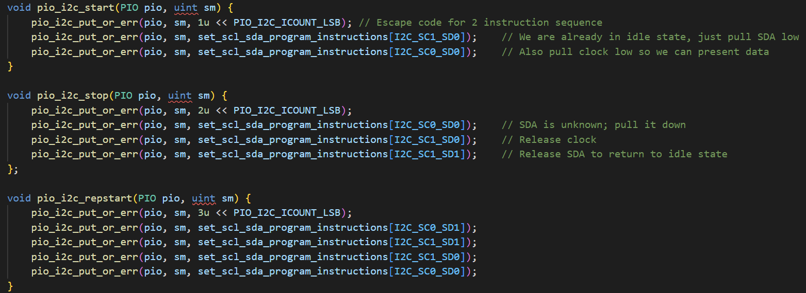

# ESE5190-Final-Project

## Introduction

This is the code for our final project. The project introduction and specification can be found on the [website](https://team-ff7.github.io/)

This code is based on the sample demo of Pico4ML. [Click here](https://github.com/ArduCAM/RPI-Pico-Cam/tree/master/rp2040_hm01b0_st7735)

## code structure

`main.c` is the main code for the gaming, including transfer camera data, drawing game and the game main loop

folder `arducam` is the lib for driving camera.

folder ` lib` is the library of device driver, including pio-i2c, lsm6ds3 driver, ST7735 driver, drawing function, and fonts.


## Game Loop

### Restart

```c
if (restart){
    car_x = 32;
    car_y = 120;
    car_w = 16;
    car_h = 30;
    for (int i = 0; i < 5; i++){
        lane_y[i] = (i - 1) * 40;
    }
    mov_speed = 2;
    for (int i = 0; i < 3; i++){
        block_y[i] = -40 - i*(rand()%40+100);
        int r = rand() % 3;
        block_x[i] = x_position[r];
        r = rand() % 4;
        block_w[i] = 15;	//fixed width of car block
        block_h[i] = rand() % 6 + 25;	//random length of car block 
        block_x[i] = block_x[i] - block_w[i] / 2;
    }
    time = 0;
    restart = false;
}
```

We just reset all the parameters in the game, and wait for the user input to restart the game.

### Rendering

We are using our function to draw pixels on the camera image, basically locate the rectangular and then substitute the corresponding element in the array.

```c
void draw_rec_onbuf (int16_t x, int16_t y, int16_t w, int16_t h, uint8_t* displayBuf, uint16_t color){
    //x=>w y=>h
	//start point: 80*y+x
    if (x < 0){
        w = w + x;
        x = 0;
    }
    else if (w + x > 80){
        w = 80 - x;
    }

    if (y < 0){
        h = h + y;
        y = 0;
    }
    else if (h + y > 160){
        h = 160 - y;
    }

    int index = (y * 80 + x) * 2;
    //printf("%d,%d\n",w,x);
    for (int i = 0; i < h; i++){
        for (int j = 0; j < w; j++){
            displayBuf[index+j*2] = (uint8_t)(color >> 8) & 0xFF;
            displayBuf[index+j*2+1] = (uint8_t)(color)&0xFF;
        }
        index = index + 80 * 2;
    }
}   
```

### Repl Control

in order to test our rendering, we have build a Repl control pannel in earlier versions. This not work well, since he delay and redundant input of keyboard.

### IMU Control

```c
readGyro(pio, sm, data);
for (int i = 0; i < 2; i++){
    if ((integflag == false) && (data[i] > 5) || (data[i] < -5)){
        integflag = true;
    }	
}
if (integflag){
    for (int i = 0; i < 2; i++){
        gyrosum[i] += data[i];
    }
    integtime -= 1;
}
if (integtime == 0){
    integflag = false;
    car_y = car_y + mov_speed + 0.2*gyrosum[1];
    car_y = car_y_lim(car_y);
    car_x = car_x + 0.2*gyrosum[0];
    car_x = car_x_lim(car_x,car_w);
}
```

```c
readAcceleration(pio, sm, data);
printf("x: %d, y: %d, z: %d.\n",data[0] ,data[1] ,data[2]);
if (data[1] > -1000) {
	car_y = car_y + mov_speed + (data[1] + 1000) / 600;
	car_y = car_y_lim(car_y);
}
else if (data[1] < -5500){
	car_y = car_y - mov_speed + (data[1] + 5500) / 1000;
	car_y = car_y_lim(car_y);
}
if (data[0] > 1700) {
	car_x = car_x - 2 - (data[0] - 1700) / 725;
	car_x = car_x_lim(car_x,car_w);
}
else if (data[0] < -1700){
	car_x = car_x + 2 - (data[0] + 1700) / 725;
	car_x = car_x_lim(car_x,car_w);
}
```

We are using both acceleration and gyro, which makes the movement more sensitive. Gyro is used for rapid and dynamic change, and acceleration is used for more slow change.

### Failure Judgement

```c
bool collFlag = 0;
for ( int i = 0; i < 3; i++){
    bool collisionX = block_x[i] + block_w[i] >= car_x && car_x + car_w >= block_x[i];
    bool collisionY = block_y_int[i] + block_h[i] >= car_y && car_y + car_h >= block_y_int[i];
    collFlag = collisionX && collisionY;
    if(collFlag){
        break;
    }
}
if (collFlag){
    gameOver();
}
```

A simple judgment for collision of 2 rectangular.

### Difficulty increase with time

```c
if (mov_speed <= 7.5){
	mov_speed += (rand() % 2) * 0.012;
}
```

The speed will grow with the time.


## Working Principle for PIO-I2C

We have already explain how this will work in [lab2b](https://github.com/Dang0v/ese5190-2022-lab2b-esp/tree/main/lab/08_adps_protocol). The code is based on the example of pico-sdk.

### PIO READ EXAPMLE ISSUE

We find that the original pio-i2c is not working, from i2c example we can know that, the read programme should be like this

```c
void read_proximity(int32_t* proximity) {

    uint8_t buf[1];
    uint8_t reg = PDATA_REG;
    i2c_write_blocking(i2c_default, addr, &reg, 1, true);  // true to keep master control of bus
    i2c_read_blocking(i2c_default, addr, buf, 1, false);  // false - finished with bus

    *proximity = buf[0];
}
```

Here we see that first the master should write a command to bus without stop bit. 

Also, from a reference, we can know that the following should be a repeat start bit.


However, in the pio-read function, it seems not working. 


```c
int pio_i2c_read_blocking(PIO pio, uint sm, uint8_t addr, uint8_t *rxbuf, uint len) {
    int err = 0;
    pio_i2c_start(pio, sm);
    pio_i2c_rx_enable(pio, sm, true);
...
```

We can see here the read function first do a start bit, this may be the reason. After replace it with function "repstar", it works.




## LSM6DS3 Configuration

It is easy to find the configuration registers and data registers from the datasheet.

 